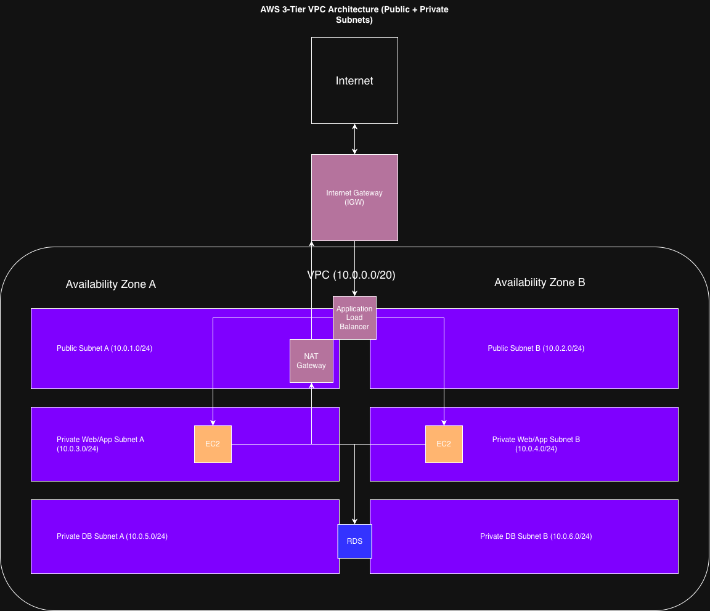

# AWS Networking Architecture Notes (Updated)

These notes reflect my understanding of AWS networking fundamentals, including VPC design, subnet behavior, routing, and secure architecture patterns.

---

## VPC Design

- **CIDR Block:** 10.0.0.0/20  
- Chosen to avoid over-allocating IP space while still allowing structured subnet segmentation.
- Supports a small-to-medium 3-tier architecture with room for growth.

---

## Subnet Architecture (Multi-AZ)

### Availability Zone A
- Public Subnet A: 10.0.1.0/24  
- Private App Subnet A: 10.0.3.0/24  
- Private DB Subnet A: 10.0.5.0/24  

### Availability Zone B
- Public Subnet B: 10.0.2.0/24  
- Private App Subnet B: 10.0.4.0/24  
- Private DB Subnet B: 10.0.6.0/24  

This structure provides:
- Isolation between tiers (web/app/db)
- High availability across AZs
- Clear network segmentation

---

## Public vs Private Subnets

A subnet is defined as public or private based on its route table:

- **Public Subnet:** Has a route to the Internet Gateway (IGW)
- **Private Subnet:** No direct route to IGW

---

## Core Components

### Internet Gateway (IGW)
- Allows inbound and outbound internet traffic for public subnets

### Application Load Balancer (ALB)
- Deployed across both public subnets
- Serves as the only public entry point
- Distributes traffic across EC2 instances in private subnets

### NAT Gateway
- Deployed in Public Subnet A
- Enables outbound internet access for private subnets
- Prevents inbound internet access

**Design Note:**  
A single NAT Gateway is used for cost efficiency in this lab.  
In production, one NAT Gateway per AZ is recommended for high availability.

### EC2 (Application Layer)
- Runs in private app subnets
- Not directly accessible from the internet

### RDS (Database Layer)
- Deployed in private DB subnets
- Uses Multi-AZ for high availability

---

## Traffic Flow

1. User sends request from the internet  
2. Traffic enters via Internet Gateway  
3. Reaches ALB in public subnets  
4. ALB routes traffic to EC2 instances in private app subnets  
5. EC2 communicates with RDS in private DB subnets  
6. Response flows back through ALB to the user  

---

## Outbound Traffic Flow

- EC2 → NAT Gateway → Internet  
- Used for:
  - OS updates
  - External API calls

---

## Security Design

- Only ALB is publicly accessible
- EC2 instances are private
- RDS is fully private
- Security groups restrict traffic between layers

---

## Failure Considerations

- If NAT Gateway fails:
  - Outbound traffic is affected
  - Application remains accessible

- If AZ fails:
  - Traffic is routed to healthy AZ
  - Application remains available

---

## Architecture Diagram

This diagram represents a secure, multi-AZ AWS architecture with proper tier isolation and controlled internet access.
